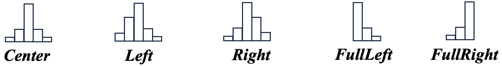

# Environment and Installation

1. Make sure to use the right CMSSW version: `CMSSW_10_6_30`

2. Clone the git project.

# The correction algorithm

The functions are implemented in `CorrFunctions.h`.

## Cluster with one single saturated strip

The correction is based on charge reconstruction of the saturated strip using only neighbourhood knowledge. This algorithm only concerns one single saturated strip clusters with a size greater than 2.

Clusters are first classified in 5 differents families (role of `ClusterShape`): 
- If adjacent strips of the maximum are similar in size $\longrightarrow$ *Center*, these are the most common clusters (~80% in muon data).
- If adjacent strips ratio differs by at least 10 % $\longrightarrow$ *Left* or *Right* (depends on the ratio), these are asymetric clusters with a charge barycenter not centered on the maximum.
- If the maximum is at the edge of the cluster $\longrightarrow$ *FullLeft* or *FullRight*, these are the most asymetric clusters.

  

After classification, according to the shape a correction is performed using coefficient templates (see below). This is the role of `ReturnCorr` wich calls `Correction_LRC` and `Correction_FL_FR`. If the corrected maximum is below 254 ADC or if the conditions are not fulfilled, this return the actual value of the maximum (meaning no correction).

## Cluster with two consecutive saturated strips

The correction is a cross-talk inversion of the two saturated strips based on the adjacent strips of these two peaks, the coefficient was established (and hard-coded here) using Monte-Carlo simulations of two muons back-to-back (simulations detailed below). These two adjacent strips represent 1/0.0613 = 16.3 \% of the total charge of the cluster.

The correction is implemented in `Correction_2strips`. If the corrected maximum is below 254 ADC or if the conditions are not fulfilled, this return the actual value of the maximum (meaning no correction).

# Create Templates for the single saturated strip clusters

The algorithm uses correction coefficients. To do so, templates are computed for each strip layer of the tracker (TIB, TOB, TID rings and TEC rings) on MC simulations of two generated muons back-to-back (with a $p_T$ from 50 to 200 GeV and $\eta$ from -3 to 3), with PU under Run2 UL conditions. The cluster collection of interest is an intermediate collection stored up to the AOD level which provides information on the simulated deposited charge on the strips associated to the muons, with no electronic saturation applied yet, without noise, without PU contamination, without zero suppression. Then, coefficients are computed by knowing the actual value of the saturated strips and its contribution on the adjacent strips.

These MC samples are local simulations stored at Strasbourg (files too large to be uploaded here). Be sure to be connected to Strasbourg somehow to be able to generate these templates or test the correction with the code detailed in the section below. This is why there are default templates already uploaded in the folder `Template_correction/`.

Use the script `Script_CreateTemplate.sh` to create the templates. It will run the code `CreateTemplate.C` on samples of two muons back-to-back and store those templates as `.txt` files in the folder `Template_correction/`. It also creates `Check_Template.root` if you want to view these correction coefficients on each tracker layer and for each shape.

# Test the correction on the samples itself

A little `.C` file exists to test and view the quality of the correction itself on single and double consecutive saturated strip clusters (on the output file `TestOnSigdigi.root`).

Use the script `Script_TestNewCorr.sh` to do so.
